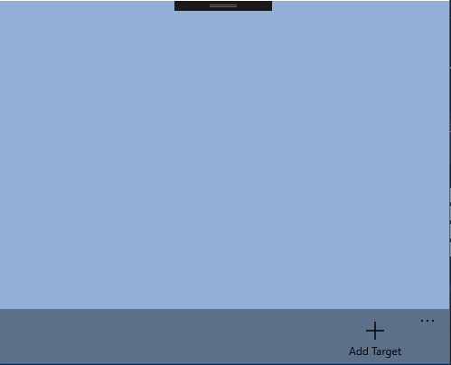
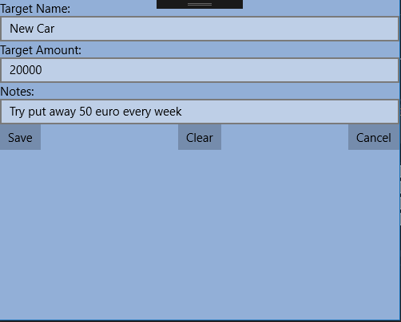
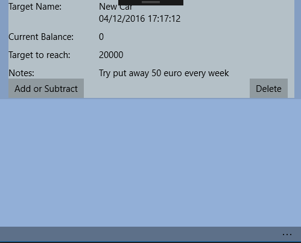
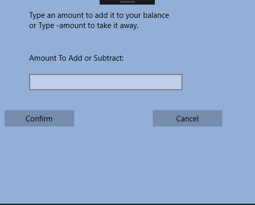
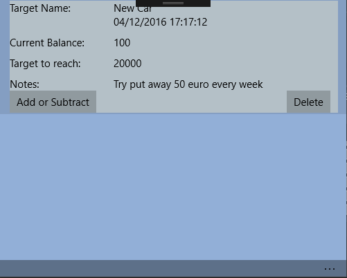

#Mobile Applications 3
##Jason McTigue
###G00312233

## Introduction
For my mobile applications module in 4th year I had to make a UWP app. I decided to make a savings accumulator app, the aim
for this app is to allow the user to enter a target and its price and then they can add or take away an amount as desired. This app 
looks quite simple but it has a lot of complexity behind as I tried to add all the technologies I learned this semester.


##Technologies 

| **Technologies**       | 
| -------------          |
| UWP    |
| MVVM    |
| Entity Framwork Core   |
| SQLite | 
| INotifyPropertyChanged |
| Data Binding to view model |
| Await and Async |
| Lambda Expressions |

##Database

To create the SQLite database I used entity framework core. I installed the following packages using NuGet Package Manager:

    - Install-Package EntityFramework.SQLite –Pre
    - Install-Package EntityFramework.Commands –Pre 

I then Create a data model and Create a database file called SavingsAccumulator2.db.
Finally  I ran:

    -Add-Migration MyFirstMigration
    
 This then created the initial set of tables for my model.
 
 To make sure this works on every device the application is run on, I added the following code to the app.xaml.cs page.
 
 ```
 using (var db = new TargetDataContext()) {
                db.Database.Migrate();
            }
            
```

This will take care of creating the local database for each new device.


## How to use the application
To use the Application the user needs to click on the command bar in the bottom right hand side of the screen and then click on the add icon.
From here the user can add their target the amount there saving for and any notes.

This saving target is then added to the database and is displayed on the homescreen. From here the user can see how close they are to reaching their target and have the ability to add and subtract an amount from there account.

An Example of how to use the app is demonstrated in the following screenshots:








## Problems
In general I found this project to be quite challenging as there were a few more features that I would have like to add in.
I tried to add in error handling on the text boxes by using [WinUx](http://jamescroft.co.uk/blog/winux/adding-textbox-validation-to-your-uwp-application-with-winux/) but I was unable to fully implement it in to my project.

Another feature that I would have like to add was a progress bar which would increase and decrease depending on the values inputted. I couldn’t
figure out why this wouldn't work as I had set the minimum value as the current balance and the maximum as the target to reach.

Finally I would have like to add in an update feature but due to time constraints  I was unable to add it in.